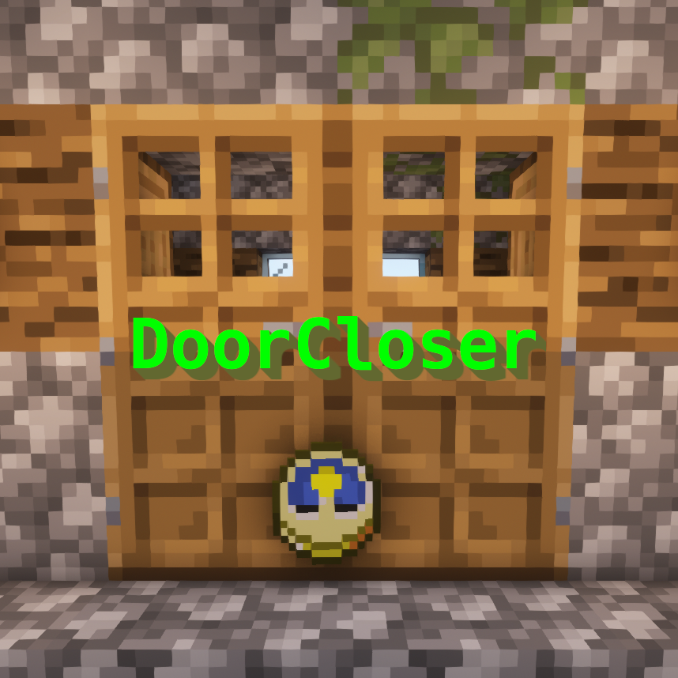

# DoorCloser

A Minecraft Bukkit plugin which automatically closes doors opened by players after some time.

## What is it?

Do you hate it when someone walks into your house and keeps the door opened? Then DoorCloser is the right plugin for you!

DoorCloser tracks opened doors and automatically closes them after a configurable time (60 seconds by default).

The plugin also supports defining a list of door types which should be automatically closed. In that way, you might let the plugin only close oak doors while keeping jungle doors open all the time.

## How to use it?

The plugin doesn't use any commands. Just open any door and it will close it for you after the defined timeout has been elapsed.

## Build

You can build the project in the following 2 steps:

 * Check out the repository
 * Build the jar file using maven: *mvn clean package*

**Note:** JDK 1.8 and Maven is required to build the project!